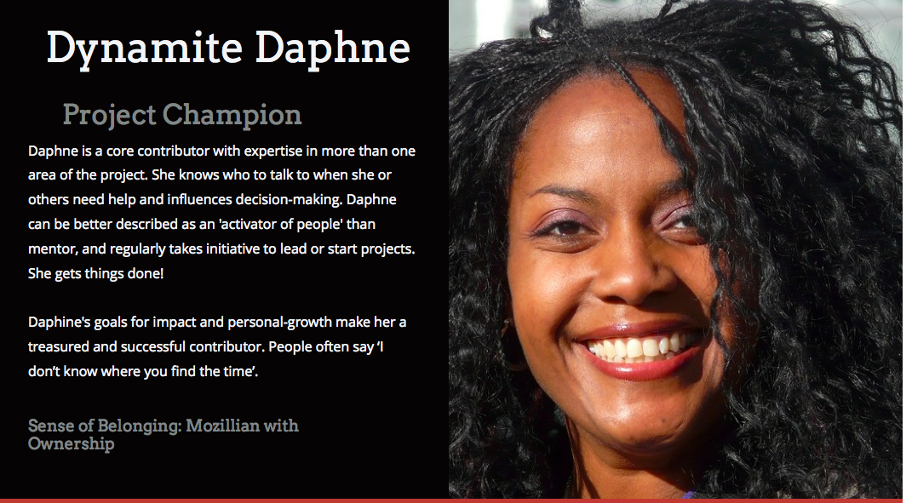
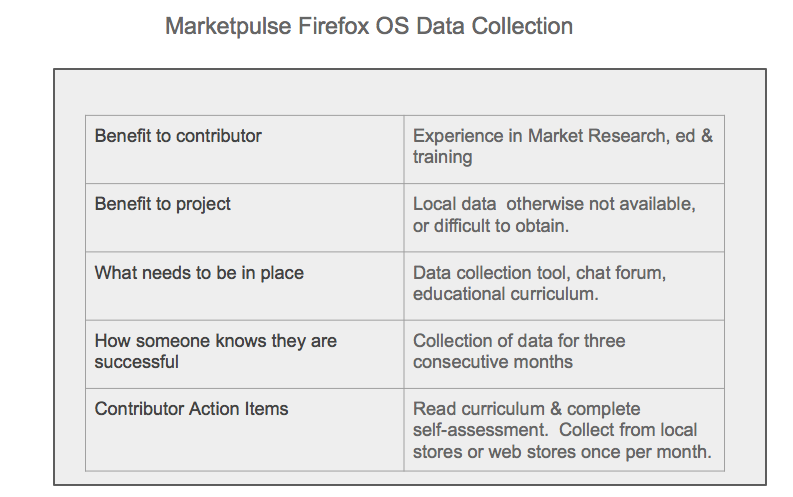

#Supercharge Your Community!

> Empathy is not taught, it's caught' - Mary Ross Founder of Roots of Empathy.
> 

## About This Workshop

This workshop falls under 'Building for Action and Impact' one of our identified building blocks for a [Participation Leadership Framework (v.1)](http://tiptoes.ca/wp-content/uploads/2015/08/2015-08-28_1244.png)

This fast-paced workshop helps community leaders gain empathy for their community, whether they are just starting to grow a contributor base, or evaluating successes and struggles of the existing. A series of activities will help participants define and co-create the first successful steps of a contributor pathway.

## Learn / Make / Share

Participants will **learn** best practices for designing personas and pathways in their communities.

Participants will **design** their own Personas and Participation Pathways for their project/community.

Participants will **share** their findings, and collaborate on ideas with others in their group.

## Format

This workshop is optimized for a fast-paced hour.  However, you can easily increase alotted times and run the same workshop as a half day event.  

### Audience

Anyone interested in building community, or already working with community who want to better identify Personas and design for their successful participation.  Example Audiences:

* Open Science Project Leader
* Mozilla Clubs Regional Community Coordinator
* QA Community Lead
* Mozilla Indonesia FFSA Lead
* Community Initiative Lead (i.e.: Community Design)

### Materials

* Sticky Notes
* Persona Template
* Step Template
* Pathway Example

## Terminology

### Persona 

Personas are identified contributor-types in the community.  We bring them to life by thinking about their needs, wants, struggles and ambitions and refer to them by name when identifying and designing meaningful contribution opportunity.  Thinking about who we are designing for, what they want to do, and how we can make them successful generates greater quality of work and a sustained model of Participation. 

 

### Participation Steps

Steps are a way of designing community contribution one experience at a time.  What this means is, instead of talking about 'work or tasks', we think about *opportunities and challenges* presented in specific actions for both project and person when they take an action to contribute.  For each action we ask ourselves a series of questions to ensure the experience has depth.

Attributes of a step might vary from project to project, but here described here are the minimum considerations.

* Prerequisite Step   
* Benefit to contributor
* Benefit to project
* What needs to be in place
* How someone knows they are successful
* Contributor action items
* Potential next-step

### Sample Step

### Pathway / Ladder

Participation pathways (we sometimes call them ladders as well), like actual paths guide someone from a starting point, to the place they want to go, or can potential go.

Pathways always start with an identified entry point, and an end point which represents the potential for sustained participation. 

This isn't to say that there we're designing with rigidness, but rather being deliberate about the depth of each step as well as the journey.  

#### Multiple Pathways

The potential of using pathways is that you can design more than one, which have the potential to intersect. We will not be covering multiple pathways in **this workshop**.

======

Image Credit : [Ian Sane](https://www.flickr.com/photos/31246066@N04/)

