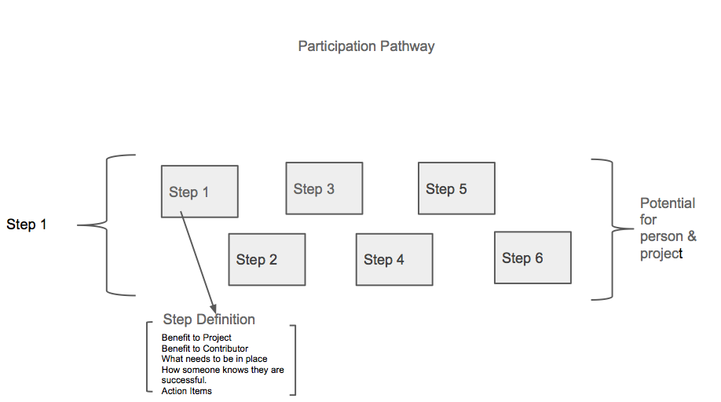

#Supercharge Your Community!

> Empathy is not taught, it's caught' - Mary Ross Founder of Roots of Empathy.
> 

## About This Workshop

This workshop falls under 'Empowering Teams and People' one of our identified building blocks for a [Participation Leadership Framework (v.1)](http://tiptoes.ca/wp-content/uploads/2015/08/2015-08-28_1244.png)

This fast-paced workshop helps community leaders gain empathy for their community, whether they are just starting to grow a contributor base, or evaluating successes and struggles of the existing. A series of activities will help participants define and co-create the first successful steps of a contributor pathway.

### Audience

Anyone interested in building community, or already working with community who want to better identify and design for their successful participation.  Example Audiences:

* Open Science Project Leader
* Mozilla Clubs Regional Community Coordinator
* QA Community Lead
* Mozilla Indonesia FFSA Lead
* Community Initiative Lead (i.e.: Community Design)

### Materials

* Sticky Notes
* Persona Template
* Step Template
* Pathway Example

## Terminology

### Persona 

Personas to identify and design meaningful opportunity for people in our community.  Thinking about who we are designing for, what they want to do, and how we can make them successful generates greater quality of work and a sustained model of Participation. It helps to refer to Personas by name when you're discussing contribution opportunities vrs a generic 'contributor'.

### Participation Steps

Steps are a way of designing the experience of community contribution.  What this means is, instead of thinking in 'tasks', we think about *opportunities* presenting in taking a specific action.  For that action we ask ourselves a serious of questions to ensure the experience has depth.

Attributes of a step might vary from project to project, but here described here are the minimum considerations.

* Benefit to contributor
* Benefit to project
* What needs to be in place
* How someone knows they are successful
* Contributor action items

### Sample Step

### Pathway / Ladder

Participation pathways, like sidewalks can guide someone from a starting point, to the place they want to go.  When designing pathways for community we likewise need to understand and design the points of entry, to the potential of sustained particiaption.

This isn't to say that there we are designing with rigidness, but rather being deliberate about the depth of each step as well as the journey.

